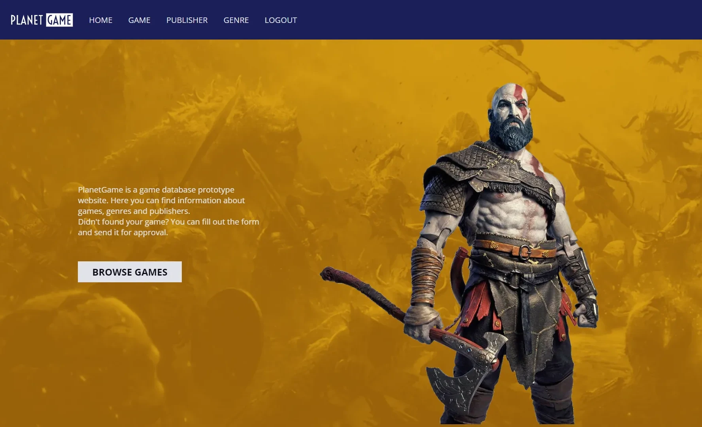
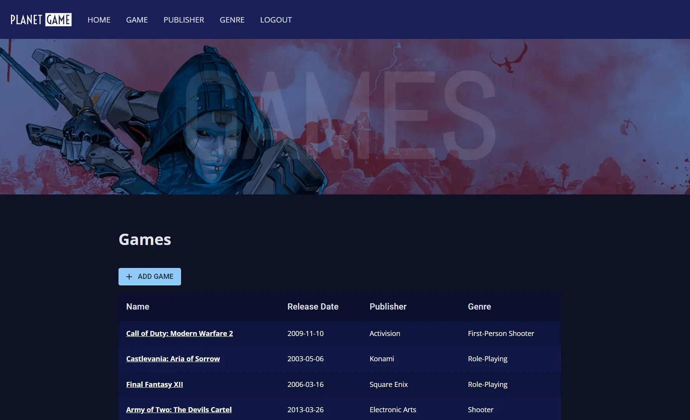
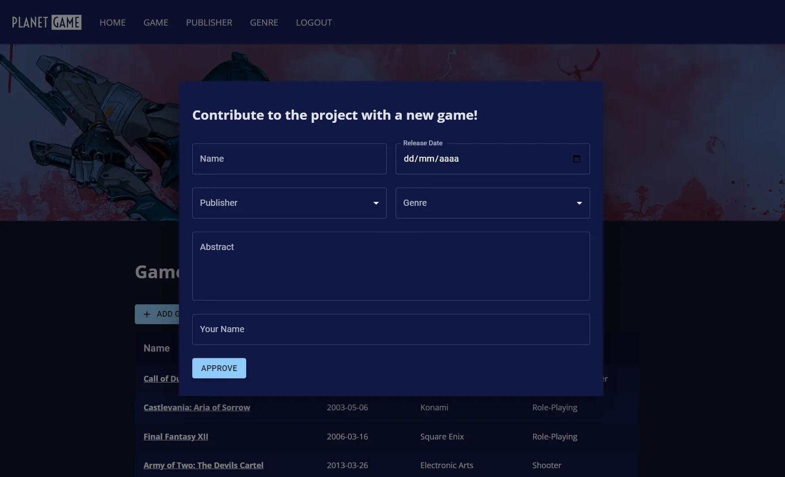
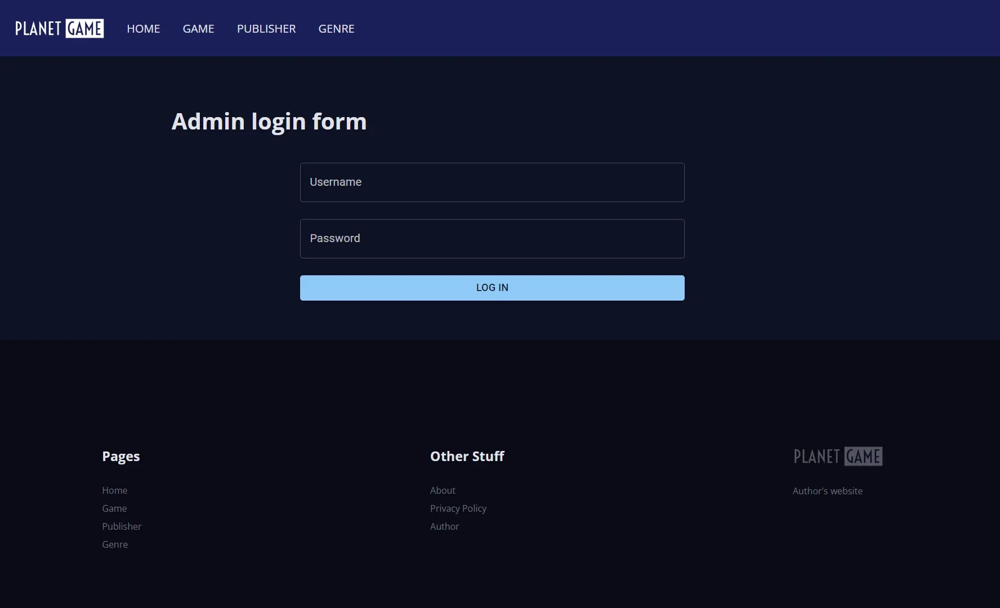
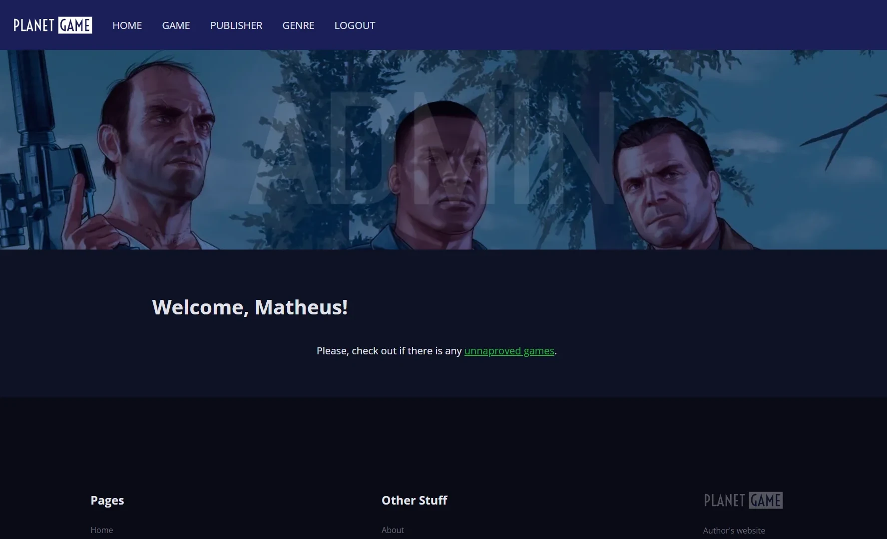
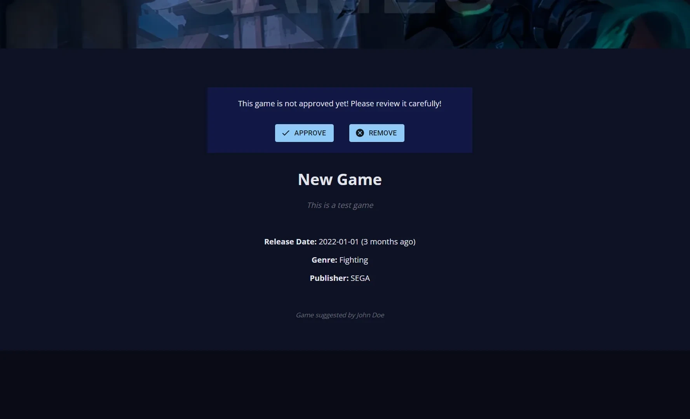

<h1 align="center">PlanetGame (front-end)</h1>

<ul>
<li><a href="#english-documentation">English documentation</a></li>
<li><a href="#documentação-em-português">Documentação em português</a></li>
</ul>

<h1 id="english-documentation">English Documentation</h1>

<h2>📜 Table of content</h2>

<!--ts-->
<ul>
    <li><a href="#about-the-project">About the project</a></li>
    <li><a href="#live-demo">Live demo</a></li>
    <li><a href="#features">Features</a></li>
    <li><a href="#front-end">Front-end</a></li>
    <ul>
        <li><a href="#layout">Layout</a></li>
        <li><a href="#technologies-front">Technologies</a></li>
    </ul>
    <li><a href="#back-end">Back-end</a></li>
    <ul>
        <li><a href="#technologies-back">Technologies</a></li>
    </ul>
    <li><a href="#database">Database</a></li>
    <li><a href="#how-to-set-up">How to set up</a></li>
    <li><a href="#inspirations">Inspirations</a></li>
    <li><a href="#author">Author</a></li>
</ul>
<!--te-->

<blockquote>
    

        <b>
            🤚 This repository is the client-side of PlanetGame, if you are interested on server-side, check <a href="https://github.com/livramatheus/planetgame_back">this repository</a>!
        </b>
    

</blockquote>

<h2 id="about-the-project">💻 About the project</h2>

    PlanetGame is a game database prototype website that indexes information about games, genres and publishers. It was developed with <b>React,  PHP and MySQL</b>.

    The main goal with this project was to release a full-stack application focusing in applying a solid development workflow, consistent code quality, a good organization and also learning new things along the way.

    In this project I tried for the fist time <b>GitHub Projects</b> with Automated Kanban, and I gotta say that the experience was incredible. Usually my personal projects development process turns out to be really chaotic, and by adopting this tool, the development workflow became way cleaner and faster.

    Another crucial mechanism that I adopted for the first time on this project was having <b>three separate environments</b>: development, <a href="https://test-planetgame.netlify.app/">test</a> and <a href="https://planetgame.netlify.app/">production</a>. This was easily achivable by pushing code to distinct git branches and turning on auto deploy on Netlify and Heroku.

    Lastly, this was the first project that I implemented a <b>JWT authentication</b>. I did the token's creation from the ground up via PHP, and, to handle it on the front-end I used a third party package. I gotta admit that the token implementation on the back-end may need some security improvements, but, for now is enough.

    You can find more detailed info about the project in the next sections.

<h2 id="live-demo">🌐 Live demo</h2>

Check out this project running on <a href="https://planetgame.netlify.app/">Netlify + Heroku</a>

<h2 id="features">🔎 Features</h2>

    The main functionality of this application is the possibility of users suggesting a game to be listed on the website through a form, without any kind of login or authentication. However, the games sent by users will remain hidden up to the point an admin reviews and approves it.

    In a more detailed way, the following are the core features of PlanetGame:

<ul>
    <li>Game genres listing</li>
    <li>Game publishers listing</li>
    <li>Games listing</li>
    <li>Publisher details</li>
    <li>Game details</li>
    <li>Game suggesting (new game)</li>
    <li>Admin login</li>
    <li>Game approval</li>
    <li>Game denial (delete)</li>
</ul>

<h2 id="front-end">Front-end</h2>

    The client-side of <b>PlanetGame</b> was built with React library. The key technical points to be noted throughout development of the front-end was the use of <b>custom hooks</b> and a clean component organization.

    The main and secondary pages are presented with random banners to maintain a refreshing experience for the user. As this process envolved a few heavy images to be loaded, I <a href="https://developers.google.com/speed/webp">converted those banners from .png to .webp</a> to improve website performance. The results was incredible: I measured the first paint of home page before and after the conversion: the loading time decreased from <b>1.4 seconds to 0.7 seconds</b>.

    To improve the user experience, in the sections where data is fetched asynchronously  from the back-end, Skeletons from MUI package was used as a placeholder until the data is completely loaded.

    The UI, being entirely <b>responsive</b> was developed from the ground up using HTML and CSS. Talking about responsiveness, a hamburger menu was also developed from scratch, only using AOS and hamburger-react libraries for its animations. 

<h3 id="layout">📐 Layout</h3>

<h4>Mobile</h4>

    
    
    
    

<h4>Desktop</h4>

    
    

    
    

    
    

<h3 id="technologies-front">🔨 Technologies</h3>

The following technologies were used to build PlanetGame front-end:

<ul>
    <li><a href="https://www.npmjs.com/package/@mui/material">@mui/material</a></li>
    <li><a href="https://www.npmjs.com/package/@date-io/date-fns">@date-io/date-fns</a></li>
    <li><a href="https://www.npmjs.com/package/aos">aos</a></li>
    <li><a href="https://www.npmjs.com/package/axios">axios</a></li>
    <li><a href="https://www.npmjs.com/package/disable-scroll">disable-scroll</a></li>
    <li><a href="https://www.npmjs.com/package/hamburger-react">hamburger-react</a></li>
    <li><a href="https://www.npmjs.com/package/jwt-decode">jwt-decode</a></li>
    <li><a href="https://www.npmjs.com/package/react-helmet">react-helmet</a></li>
    <li><a href="https://www.npmjs.com/package/react-router-dom">react-router-dom</a></li>
</ul>

<h2 id="back-end">Back-end</h2>

    PlanetGame's back-end was developed with <b>vanilla PHP</b>, behaving as an API: by expecting requests and returning JSON responses.

    The routing system of this app was developed from scratch, providing a reliable and consistent communication between front and back end.
    Another interesting feature that was developed from scratch was the <b>error logging system</b> in pair with custom Exception classes.

    Lastly, an additional noteworthy point is the back-end was consistently backed by <b>unit tests</b>, to maintain a solid code quality throughout the entire development timespan.

<h3 id="technologies-back">🔨 Technologies</h3>

The following technologies were used to build PlanetGame back-end:

<ul>
    <li><a href="https://packagist.org/packages/mpratt/relativetime">mpratt/relativetime</a> - For converting dates to sentences like "1 year ago"</li>
    <li><a href="https://packagist.org/packages/mofodojodino/profanity-filter">mofodojodino/profanity-filter</a> - For filtering out bad words from forms</li>
    <li><a href="https://packagist.org/packages/phpunit/phpunit">phpunit/phpunit</a></li>
</ul>

<h2 id="database">Database</h2>

PlanetGame's database of choice was <a href="https://www.mysql.com">MySql</a>. Check out a brief description of the tables:

<ul>
    <li><strong>tb_admin:</strong> stores admins;</li>
    <li><strong>tb_game:</strong> store games. It is related to genres and publisher;</li>
    <li><strong>tb_genre:</strong> store game genres;</li>
    <li><strong>tb_publisher:</strong> stores game publishers</li>
</ul>

<h3 id="how-to-set-up">❓ How to set up</h3>

If you wish to fork this project you'll need to set up the following environment variables:

<h4 id="client-side-">Client-side:</h4>
<ul>
    <li>
        <strong>REACT_APP_API_URL</strong> (Server URL in order to send requests)
    </li>
    <li>
        <strong>REACT_APP_PUBLIC_URL</strong> (Front-end URL)
    </li>
</ul>

<h4 id="server-side-">Server-side:</h4>
<ul>
    <li>
        <strong>ADMIN_SALT</strong> (Salt for managing admin's passwords)
    </li>
    <li>
        <strong>CLEARDB_DATABASE_URL</strong> (URL for database connection)
    </li>
    <li>
        <strong>CLIENT_URL</strong> (Front-end url for CORS purposes)
    </li>
    <li>
        <strong>JWT_TOKEN_KEY</strong> (JWT secret for managing tokens)
    </li>
</ul>

<h3 id="inspirations">😁 Inspirations</h3>

PlanetGame was inspired by the following projects on Figma:

<ul>
    <li><a href="https://www.figma.com/community/file/871334426251486294">GWP TeamFight Tactics</a> (inspired PlanetGame color scheme)</li>
    <li><a href="https://www.figma.com/community/file/814078062940878144">LOL - 404 page for Weekly Warm-Up</a> (inspired PlanetGame UI)</li>
</ul>

<h3 id="author">👩‍🦲 Author</h3>

Full stack developed by <strong>Matheus do Livramento</strong>.

<a href="https://github.com/livramatheus">GitHub</a> | <a href="https://www.linkedin.com/in/livramatheus">LinkedIn</a> | <a href="https://www.livramento.dev/">Website</a>

<h1 id="documentação-em-português">Documentação em português</h1>
<h2>📜 Tabela de conteúdo</h2>

<ul>
    <li><a href="#about-the-project-br">Sobre o projeto</a></li>
    <li><a href="#live-demo-br">Live demo</a></li>
    <li><a href="#features-br">Funcionalidades</a></li>
    <li><a href="#front-end-br">Front-end</a></li>
    <ul>
        <li><a href="#layout-br">Layout</a></li>
        <li><a href="#technologies-front-br">Tecnologias</a></li>
    </ul>
    <li><a href="#back-end-br">Back-end</a></li>
    <ul>
        <li><a href="#technologies-back-br">Technologies</a></li>
    </ul>
    <li><a href="#database-br">Banco de dados</a></li>
    <li><a href="#how-to-set-up-br">Como configurar</a></li>
    <li><a href="#inspirations-br">Inspirações</a></li>
    <li><a href="#autor-br">Autor</a></li>
</ul>

<blockquote>

<strong>🤚 🤚 Este repositório é do lado do cliente do PlanetGame, se você estiver interessado no lado do servidor, verifique <a href="https://github.com/livramatheus/planetgame_back">este repositório</a>!</strong>

</blockquote>

<h2 id="about-the-project-br">💻 Sobre o projeto</h2>

    PlanetGame é um site protótipo de banco de dados de jogos que indexa informações sobre jogos, gêneros e editoras. Foi desenvolvido com <b>React, PHP e MySQL</b>.

    O principal objetivo com este projeto era lançar uma aplicação full-stack com foco em aplicar um fluxo de trabalho de desenvolvimento sólido, qualidade de código consistente, uma boa organização e também aprender coisas novas ao longo do caminho.

    Neste projeto eu utilizei pela primeira vez <b>GitHub Projects</b> com Automated Kanban, e devo dizer que a experiência foi incrível. Normalmente meu processo de desenvolvimento de projetos pessoais acaba sendo muito caótico, e ao adotar essa ferramenta, o fluxo de trabalho de desenvolvimento ficou muito mais limpo e rápido.

    Outro mecanismo crucial que adotei pela primeira vez neste projeto foi ter <b>três ambientes separados</b>: desenvolvimento, <a href="https://test-planetgame.netlify.app/">teste</a> e <a href="https://planetgame.netlify.app/">produção</a>. Isso foi facilmente alcançável enviando código para <em>branches</em> distintas do git e ativando o <em>auto deploy</em> no Netlify e no Heroku.

    Por fim, este foi o primeiro projeto em que implementei uma <b>autenticação JWT</b>. Eu fiz a criação do token do zero via PHP e, para lidar com isso no front-end, usei um pacote de terceiros. Devo admitir que a implementação do token no back-end pode precisar de algumas melhorias de segurança, mas por enquanto é suficiente.

    Você pode encontrar informações mais detalhadas sobre o projeto nas próximas seções.

<h2 id="live-demo-br">🌐 Live demo</h2>

Veja este projeto rodando no <a href="https://planetgame.netlify.app/">Netlify + Heroku</a>

<h2 id="features-br">🔎 Funcionalidades</h2>

     A principal funcionalidade deste aplicativo é a possibilidade de os usuários sugerirem que um jogo seja listado no site por meio de um formulário, sem nenhum tipo de login ou autenticação. No entanto, os jogos enviados pelos usuários permanecerão ocultos até o momento em que um administrador os revise e os aprove.

     De uma forma mais detalhada, a seguir estão os principais recursos do PlanetGame:

<ul>
     <li>Listagem de gêneros de jogos</li>
     <li>Listagem de publicadoras de jogos</li>
     <li>Listagem de jogos</li>
     <li>Detalhamento de editor</li>
     <li>Detalhamento de jogo</li>
     <li>Sugestão de jogo (novo jogo)</li>
     <li>Login do administrador</li>
     <li>Aprovação do jogo</li>
     <li>Negação de jogo (excluir)</li>
</ul>

<h2 id="front-end-br">Front-end</h2>

    O lado cliente do <b>PlanetGame</b> foi construído com a biblioteca React. Os principais pontos técnicos a serem observados durante o desenvolvimento do front-end foi o uso de <em><b>custom hooks</b></em> e uma organização limpa de componentes.

    As páginas principal e secundárias são apresentadas com <em>banners</em> aleatórios para manter uma experiência pouco enjoativa para o usuário. Como esse processo envolveu o carregamento de algumas imagens pesadas, <a href="https://developers.google.com/speed/webp">converti esses banners de .png para .webp</a> para melhorar o desempenho do site . Os resultados foram incríveis: medi o <em>first paint</em> da página inicial antes e depois da conversão: o tempo de carregamento médio diminuiu de <b>1,4 segundos para 0,7 segundos</b>.

    Para melhorar a experiência do usuário, nas seções em que os dados são buscados de forma assíncrona do back-end, o pacote Skeletons from MUI foi usado como um <em>placeholder</em> até que os dados sejam completamente carregados.

    A interface do usuário, sendo totalmente <b>responsiva</b>, foi desenvolvida do zero usando HTML e CSS. Falando em responsividade, um <em>hamburger menu</em> também foi desenvolvido do zero, usando apenas AOS e bibliotecas hamburger-react para suas animações.

<h3 id="layout-br">📐 Layout</h3>

<h4>Mobile</h4>

    
    
    
    

<h4>Desktop</h4>

    
    

    
    

    
    

<h3 id="technologies-front-br">🔨 Tecnologias</h3>

As seguintes tecnologias foram utilizadas para construir o front-end de PlanetGame:

<ul>
    <li><a href="https://www.npmjs.com/package/@mui/material">@mui/material</a></li>
    <li><a href="https://www.npmjs.com/package/@date-io/date-fns">@date-io/date-fns</a></li>
    <li><a href="https://www.npmjs.com/package/aos">aos</a></li>
    <li><a href="https://www.npmjs.com/package/axios">axios</a></li>
    <li><a href="https://www.npmjs.com/package/disable-scroll">disable-scroll</a></li>
    <li><a href="https://www.npmjs.com/package/hamburger-react">hamburger-react</a></li>
    <li><a href="https://www.npmjs.com/package/jwt-decode">jwt-decode</a></li>
    <li><a href="https://www.npmjs.com/package/react-helmet">react-helmet</a></li>
    <li><a href="https://www.npmjs.com/package/react-router-dom">react-router-dom</a></li>
</ul>

<h2 id="back-end-br">Back-end</h2>

     O back-end do PlanetGame foi desenvolvido com <b>PHP vanilla</b>, comportando-se como uma API: esperando requisições e retornando respostas JSON.

     O sistema de roteamento deste aplicativo foi desenvolvido do zero, fornecendo uma comunicação confiável e consistente entre front-end e back-end.
     Outro recurso interessante que foi desenvolvido do zero foi o <b>sistema de registro de erros</b> em conjunto com classes de exceção customizadas.

     Por fim, um ponto crucial a ser notado é que o back-end foi consistentemente apoiado por <b>testes unitários</b>, para manter uma qualidade de código sólida durante todo o processo de desenvolvimento.

<h3 id="technologies-back-br">🔨 Tecnologias</h3>

As seguintes tecnologias foram utilizadas para desenvolver o sevidor do PlanetGame:

<ul>
    <li><a href="https://packagist.org/packages/mpratt/relativetime">mpratt/relativetime</a> - Para converter datas em frases como "1 year ago"</li>
    <li><a href="https://packagist.org/packages/mofodojodino/profanity-filter">mofodojodino/profanity-filter</a> - Para eliminar palavrões enviados pelos formulários</li>
    <li><a href="https://packagist.org/packages/phpunit/phpunit">phpunit/phpunit</a></li>
</ul>

<h2 id="database-br">Banco de Dados</h2>

O banco de dados escolhido para o PlanetGame foi o <a href="https://www.mysql.com">MySql</a>. Confira uma breve descrição das tabelas:

<ul>
     <li><strong>tb_admin:</strong> armazena administradores;</li>
     <li><strong>tb_game:</strong> armazena jogos. Está relacionado a gêneros e publicadoras;</li>
     <li><strong>tb_genre:</strong> armazena gêneros de jogos;</li>
     <li><strong>tb_publisher:</strong> armazena as publicadoras de jogos</li>
</ul>

<h3 id="how-to-set-up-br">❓ Como configurar</h3>

Se você deseja fazer um <em>fork</em> deste projeto, você precisará configurar as seguintes variáveis de ambiente:

<h4 id="client-side-">Client-side:</h4>

<ul>
     <li>
         <strong>REACT_APP_API_URL</strong> (URL do servidor para enviar solicitações)
     </li>
     <li>
         <strong>REACT_APP_PUBLIC_URL</strong> (URL de front-end)
     </li>
</ul>

<h4 id="server-side-">Server-side:</h4>

<ul>
     <li>
         <strong>ADMIN_SALT</strong> (Salt para gerenciar as senhas do administrador)
     </li>
     <li>
         <strong>CLEARDB_DATABASE_URL</strong> (URL para conexão de banco de dados)
     </li>
     <li>
         <strong>CLIENT_URL</strong> (URL de front-end para fins de CORS)
     </li>
     <li>
         <strong>JWT_TOKEN_KEY</strong> (segredo JWT para gerenciamento de tokens)
     </li>
</ul>

<h3 id="inspirations-br">😁 Inspirações</h3>

PlanetGame foi inspirado pelos seguintes projetos do Figma:

<ul>
    <li><a href="https://www.figma.com/community/file/871334426251486294">GWP TeamFight Tactics</a> (inspirou a paleta de cores usada no PlanetGame)</li>
    <li><a href="https://www.figma.com/community/file/814078062940878144">LOL - 404 page for Weekly Warm-Up</a> (inspirou a UI do PlanetGame)</li>
</ul>

<h3 id="autor-br">👩‍🦲 Autor</h3>

Full stack  desenvolvido por <strong>Matheus do Livramento</strong>.

<a href="https://github.com/livramatheus">GitHub</a> | <a href="https://www.linkedin.com/in/livramatheus">LinkedIn</a> | <a href="https://www.livramento.dev/">Website</a>

